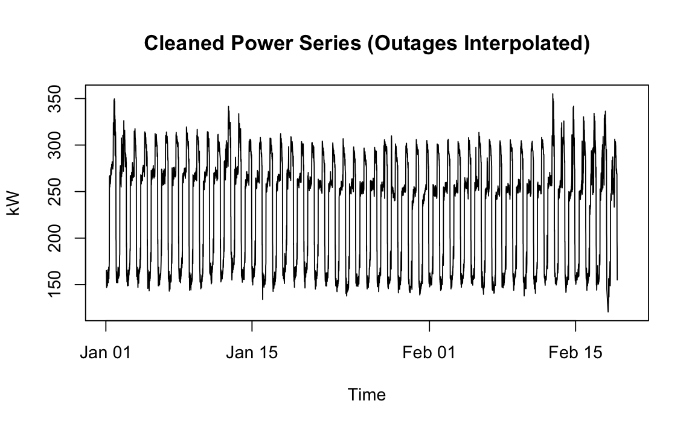
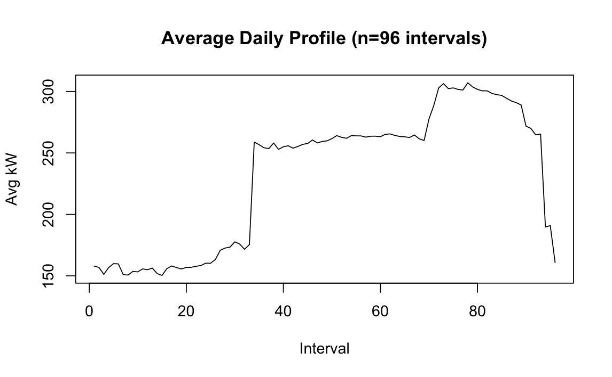
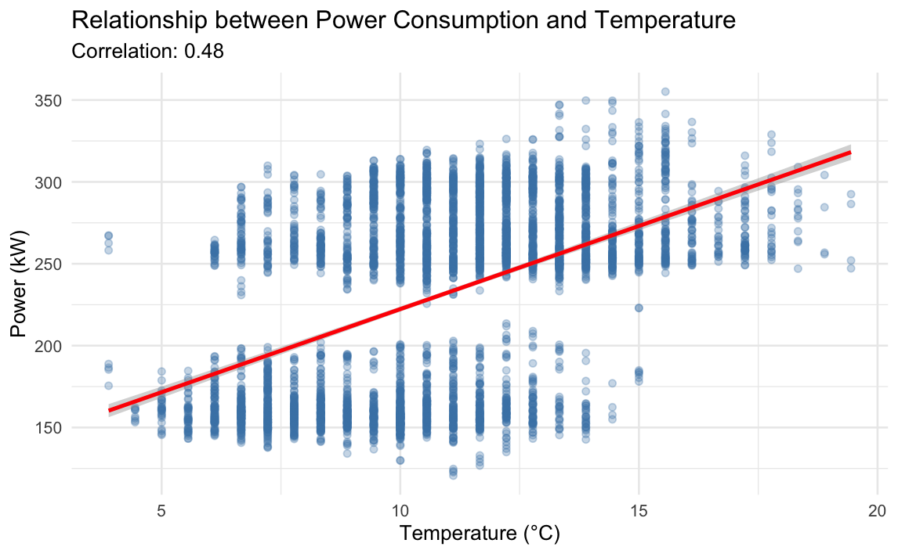
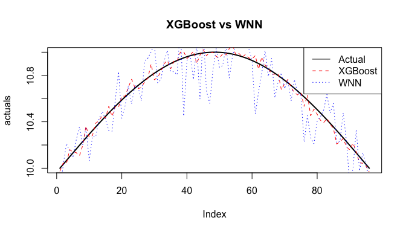
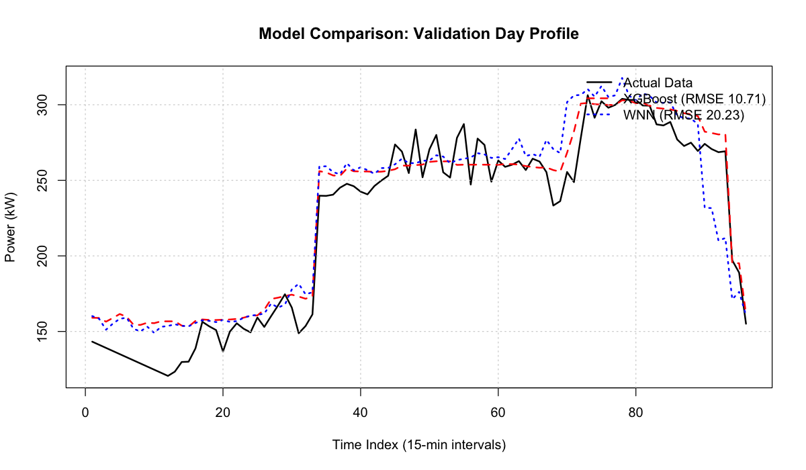

<div align="center">

# wnnTS

### *Weighted Nearest Neighbors for Electricity Load Forecasting*


[](https://www.r-project.org/)
[]()
[]()
[]()

*Master 2 SISE Project - Time Series*  
*Université Lumière Lyon 2 | 2025–2026*

[Overview](#overview) • [Methodology](#methodology) • [Package](#package) • [Installation](#installation) • [Quick Start](#quick-start)

---

</div>

## Table of Contents

- [Overview](#overview)
- [Objectives](#objectives)
- [Project Highlights](#project-highlights)
- [Methodology](#methodology)
- [Package](#package)
- [Installation](#installation)
- [Quick Start](#quick-start)
- [Reproducibility](#reproducibility)
- [Project Structure](#project-structure)
- [Contributing](#contributing)
- [License](#license)
- [Bibliography](#bibliography)

---

## Overview

**wnnTS** is an academic project dedicated to **electricity load forecasting** using classical, machine learning, and weighted nearest neighbors models.

Provided a dataset containing electricity consumption (kW) and outdoor air temperature (°C), both measured every **15 minutes** for a single building over **49 days**, the goal is to forecast electricity consumption for the **50th day (96 time steps)**, given historical consumption data and known temperature values for the forecast horizon.


### Dataset overview & exploratory analysis

Key observed properties:
- strong and stable daily seasonality (96 intervals per day)
- recurring load patterns across days
- suitability for pattern-based forecasting methods

<p align="center">
  
</p>

<p align="center">
  
</p>

Although outdoor temperature is moderately correlated with power consumption (Pearson correlation ≈ 0.48), it does not fully explain the short-term variability of the load.

This suggests that a large part of the signal dynamics is driven by recurrent temporal patterns (daily routines, operational schedules, i.e. human activity), which motivates the use of pattern-based forecasting methods such as Weighted Nearest Neighbors.

<p align="center">
  
</p>

These observations motivate the exploration of forecasting approaches that exploit recurrent temporal patterns rather than relying solely on exogenous variables.

---

## Objectives

### Part 1 — Model comparison

- Apply and compare families of forecasting models:
  - **Baseline and deterministic models** (naive and seasonal naive baseline, random walk with drift, exponential smoothing)
  - **Stochastic time series models** (SARIMA, SARIMAX)
  - **Regression-based models** (quadratic regression with temperature effects, NNAR)
  - **Machine learning models** (Random Forest, XGBoost, Support Vector Regression, Facebook Prophet)
- Tune model hyperparameters
- Evaluate models using **rolling-origin cross-validation**
- Select the **best-performing model**
- Produce a final **24-hour forecast (96 values)**

Hyperparameter tuning and model evaluation are performed following a rigorous and unified strategy, detailed in the [model comparison framework](doc/notebooks/model_comparison_framework.md).

### Part 2 — Weighted Nearest Neighbors

- Implement the **Weighted Nearest Neighbors (WNN)** forecasting method
- Package the implementation in a **fully installable R package**
- Provide a **vignette** demonstrating the use of the package
- Compare WNN forecasts with the best model selected in Part 1

---

## Project Highlights

- Strict respect of **time series forecasting constraints**
- No data leakage (rolling-origin evaluation)
- Unified comparison framework across heterogeneous models
- Educational and transparent implementation of WNN
- Clear separation between:
  - exploratory work
  - package development
  - academic reporting

---

## Methodology

The project follows a complete and reproducible forecasting workflow:

```
Raw time series
↓
Exploratory analysis and preprocessing
↓
Train / validation split via rolling-origin CV
↓
Benchmark of classical and ML forecasting models
↓
Model selection based on forecast accuracy
↓
Final forecast for 2010-02-19 (96 steps)
↓
Weighted Nearest Neighbors implementation
↓
Comparison between WNN and best benchmark model
```

Details on the model optimization and evaluation protocol are provided in a dedicated document: [model_comparison_framework.md](doc/notebooks/model_comparison_framework.md).


### Model Comparison

To illustrate the differences between global regression-based approaches and local pattern-based methods, the following figure compares forecasts produced by a tuned XGBoost model and the Weighted Nearest Neighbors (WNN) approach on a representative validation day.

While XGBoost leverages global relationships between covariates and the target variable, WNN relies exclusively on temporal pattern similarity. Both methods successfully capture the main daily structure of the load, but exhibit different behaviors in terms of smoothness and local adaptability.

<p align="center">
  <br>
  <sup>
    XGBoost vs WNN on a synthetic sinusoidal time series.<br>
    XGBoost produces a smoother global approximation, while WNN reflects local pattern variability induced by nearest-neighbor matching.
  </sup>
</p>

<p align="center">
  <br>
  <sup>
    Validation-day forecast comparison between XGBoost and Weighted Nearest Neighbors (WNN) on real electricity consumption data.
  </sup>
</p>

---

## Package

The WNN approach complements regression-based models by focusing on local temporal similarity rather than global functional relationships.

The `WNNRina` package implements a **Weighted Nearest Neighbors (WNN)** forecasting method for time series data.

This non-parametric approach predicts future values by identifying historical windows similar to the current situation and producing forecasts as a weighted average of the trajectories that followed these neighbors in the past.

The package provides:
- an implementation of the WNN forecasting algorithm
- control over the window size and number of neighbors
- forecasting over arbitrary horizons
- simple visualization utilities
- a pedagogical vignette illustrating the method

### Example usage

```r
library(WNNRina)

set.seed(123)
history <- sin(seq(0, 100, length.out = 2000)) + rnorm(2000, sd = 0.1)

forecast <- predict_wnn(
  train_y    = history,
  window_size = 96,
  k           = 5,
  forecast_h  = 96
)

plot(
  forecast,
  type = "l",
  col  = "blue",
  main = "WNN Forecast Example",
  ylab = "Value"
)
```

A full methodological description and additional examples are provided in the package vignette:

```r
vignette("Introduction to WNNRina")
```

---

## Installation

The `WNNRina` package is developed in an academic context and is not published on CRAN.

To install it locally from source, clone the repository and install the package using `devtools`:

```r
# Install devtools if needed
install.packages("devtools")

# Install WNNRina from local source
devtools::install(".")
```

---

## Quick Start

The main function provided by the package is `predict_wnn`, which implements a **Weighted Nearest Neighbors (WNN)** forecasting strategy for time series data.

Below is a minimal example, identical to the one used in the package vignette.

```r
library(WNNRina)

# Generate a synthetic seasonal signal
set.seed(123)
history <- sin(seq(0, 100, length.out = 2000)) + rnorm(2000, sd = 0.1)

# Forecast the next 96 points (24 hours at 15-minute intervals)
forecast <- predict_wnn(
  train_y   = history,
  window_size = 96,
  k           = 5,
  forecast_h  = 96
)

plot(
  forecast,
  type = "l",
  col  = "blue",
  main = "WNN Forecast Example",
  ylab = "Value"
)
```

The full methodological explanation and additional examples are available in the package vignette:
```r
vignette("Introduction to WNNRina")
```

---

## Reproducibility

The entire project is fully reproducible.

All data preprocessing, exploratory analysis, model benchmarking, and hyperparameter tuning are implemented in a single Quarto notebook.  
To reproduce the full workflow:

1. Download the [Quarto notebook](doc/notebooks/wnnTS_notebook.qmd) from the repository
2. Open it in [**RStudio**](https://posit.co/download/rstudio-desktop/)
3. Run the notebook from start to end

> ⚠️ **Note on computation time**  
> Running the full notebook can take a significant amount of time.  
> This is expected, as model hyperparameters are tuned using grid search combined with rolling-origin cross-validation.  
> Some models (e.g. XGBoost, neural networks) are particularly computationally expensive under this evaluation scheme.  
> Depending on hardware, a full run may take over an hour.

<p align="center">
  <br>
  <sup>“My neural network is CV-rolling.”</sup><br>
  <sup><sub>Inspired by <a href="https://xkcd.com/303/" target="_blank">XKCD #303</a> (Randall Munroe).</sub></sup>
</p>

---

## Project Structure

```
wnnTS/
│
├── R/                  # WNN implementation
├── man/                # Documentation
├── vignettes/          # Package vignette (R Markdown)
├── notebooks/          # Model comparison (Part 1)
├── report/             # Short academic report (PDF)
├── README.md
└── DESCRIPTION
```

---

## Contributing

This project was developed in an academic context, but feedback and suggestions are welcome.

If you would like to:
- report a bug or an inconsistency
- suggest an improvement or extension
- discuss methodological choices
- ask questions about the implementation

Feel free to open an issue on the GitHub repository or contact the author directly.

Contributions are not expected, but constructive comments are always appreciated.

---

## License

This project is developed in an academic context. For educational use only.

---

## Bibliography

Talavera-Llames, R.L., Pérez-Chacón, R., Martínez-Ballesteros, M., Troncoso, A., Martínez-Álvarez, F. (2016). *A Nearest Neighbours-Based Algorithm for Big Time Series Data Forecasting*. In: Martínez-Álvarez, F., Troncoso, A., Quintián, H., Corchado, E. (eds) Hybrid Artificial Intelligent Systems. HAIS 2016. Lecture Notes in Computer Science, vol 9648. Springer, Cham

---

<div align="center">

wnnTS — Weighted Nearest Neighbors for Electricity Load Forecasting

</div>


[^1]: Talavera-Llames, R.L., Pérez-Chacón, R., Martínez-Ballesteros, M., Troncoso, A., Martínez-Álvarez, F. (2016). A Nearest Neighbours-Based Algorithm for Big Time Series Data Forecasting. In: Martínez-Álvarez, F., Troncoso, A., Quintián, H., Corchado, E. (eds) Hybrid Artificial Intelligent Systems. HAIS 2016. Lecture Notes in Computer Science, vol 9648. Springer, Cham.
